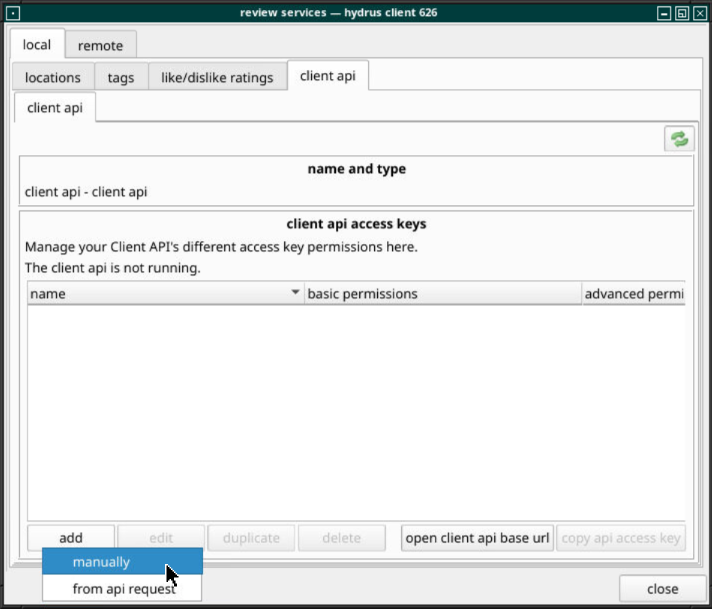
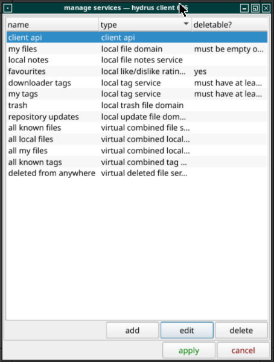

# Getting started

This guide assumes you are already running a hydrus client. If you aren't, check out the [Running hydrus network](../running-hydrus-network) page first.

## Setting up an API key

Using the hydrus client UI, create an API key for Hydrui. To create an API key, first enter the review services window by going to the services → review services menu from the main menu bar.

Navigate to local → client api → client api in the tab hierarchy. Click the add button, then select &ldquo;manually&rdquo;.

You don't need to modify the default permissions unless you are concerned about granting Hydrui too much access, so you can keep the default "permits everything" options. You can copy the access key, then save it by clicking apply. **Make note of the access key, since you'll need it to log in.**

## Enabling the client API service

You need to enable the client API service and ensure that the port it is opened on is accessible to your browser. Firstly, access the services → manage services menu from the main menu bar.

In the manage services window, either double click &ldquo;client api&rdquo;, or select it and then select the edit button.

Enable the service. Optionally, configure it as needed:

- Allow non-local connections; this is needed if you want to make the API port accessible externally.

- Enable CORS headers; this is usually necessary for a remote client like Hydrui (although it is _not_ needed if you are self-hosting and using server mode, since all requests will be proxied.)

Then click &ldquo;apply&rdquo;.

## Accessing the port

Hydrui needs to be able to access your hydrus client API port. Generally, this means you need to be able to access it from the web browser(s) you wish to use Hydrui from.

- **If the hydrus client is running on the same machine**, usually you can access the port directly via localhost.

- **If the hydrus client is running on another machine in the same local network**, you may be able to access it via the machine's local network IP address. You may need to ensure that any firewalls on the local machine allow incoming traffic on the port.

- **If you want to access a hydrus client over the internet**, you may need a more complicated setup.
  - You can use port forwarding with a home router to expose a port on your home internet IP address, if your home internet has a dedicated port. You will need to find the administration interface for your router, which is generally accessible at a location like <http://192.168.1.1> or <http://192.168.0.1>.

  - You can use a VPN connection to bridge computers on different networks together so that they can access each other as if they are on a local network together. For example, you can use [Tailscale](https://tailscale.com/) on the machine running the hydrus client and the machine accessing Hydrui from a browser, or you can set up a Wireguard VPN yourself. If you're using Tailscale, you'll need to use the Tailscale IP or hostname to access your hydrus client API port.

- **If you run the Hydrui server in server mode**, you can expose Hydrui instead and keep hydrus client only accessible locally.

In any case, you will be able to verify if your API server is accessible by trying to navigate to it directly. Once you can access this page, you should be able to use Hydrui.

In this example, you will be able to use <http://localhost:45869> as the client API URL.

## Logging into Hydrui

You now have everything you need to log into Hydrui, but you may still need to deal with one last hurdle. First, try logging in by going to the [hosted log in page](/client) and entering your client API URL (e.g. <http://localhost:45869>) and API key (the access key from earlier). Depending on your browser, the operation may not succeed.

A common reason for this is a security feature of modern web browsers that tries to upgrade requests to use HTTPS. In most cases, your hydrus client API service will not be accessible over HTTPS, and even if it is, it will not have a valid certificate. You can disable this security feature just for Hydrui. The exact method to do so will vary depending on browser. After performing a log-in attempt, here is the option in Librewolf:

After doing this, it should now be possible to log into your hydrus client API.

## Self-hosting

Using Hydrui through the hosted instance should be secure and private; Hydrui does not automatically collect any information. However, using a hosted service always comes with risks. You can self-host Hydrui to mitigate some of those risks. For more information about self-hosting, please check out the [self-hosting](../../self-hosting) section.
